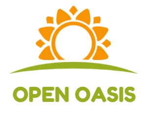

# OpenOasis

   

**Open-Oasis，开放的绿洲，一个开放的物理世界机理模型学习项目。**

---------------------------------------------------------------------------

# 绿洲循环系统
作为简化现实的微缩物理模型，绿洲循环系统描述了其中主要的物质和能量流动过程。籍此，  
我们可以学习和深入理解我们周围的世界。

[水循环系统](./SystemOfWaterCirculation/README.md)  
[热循环系统](./SystemOfThermalCirculation/README.md)  
[碳循环系统](./SystemOfCarbonCirculation/README.md)  

---------------------------------------------------------------------------

# 绿洲数据体系
21世纪，数据大爆炸，然而如何提取我们需要的数据、如何评估数据质量、如何完整展示数据？  
面对各种纷杂的数据，我们需要有自己的处理能力。  

[数据获取方案](./DataAcquireScheme/README.md)  
[数据分析方案](./DataAnalyseScheme/README.md)  
[数据展示方案](./DataVisualsScheme/README.md)  

---------------------------------------------------------------------------

# 绿洲资源
综合我们所能获取的各类资源，包括高质量的算例、场景应用方案、专业学习资料等，为你的  
学习、工作、研究提供参考和启发。  

[资源](./resource/README.md)

---------------------------------------------------------------------------